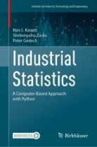

# Code repository
<table>
<tr>
<td><!----></td>
<td>
  <b>Industrial Statistics: A Computer Based Approach with Python</b>

by Ron Kenett, Shelemyahu Zacks, Peter Gedeck

Publisher: Springer International Publishing; 1st edition (TBA)
<!--
ISBN-13: 978-3031075650
Buy on 
<a href="https://www.amazon.com/Modern-Statistics-Computer-Based-Technology-Engineering/dp/303107565X/">Amazon</a>, 
<a href="https://www.barnesandnoble.com/w/modern-statistics-ron-kenett/1141391736">Barnes & Noble</a>
-->
<!-- Errata: http://oreilly.com/catalog/errata.csp?isbn=9781492072942 -->
</td>
</tr>
</table>

<i>Industrial Statistics: A Computer Based Approach with Python</i> is a companion volume to the book <a href="../ModernStatistics"><i>Modern Statistics: A Computer Based Approach with Python.</i></a>

<!-- 
This part of the repository contains:

- `notebooks`: Python code of individual chapters in 
  [Jupyter notebooks](https://github.com/gedeck/mistat-code-solutions/new/main/ModernStatistics/notebooks) - 
  [download all as notebooks.zip](notebooks.zip)
- `code`: Python code for solutions as plain 
  [Python files](https://github.com/gedeck/mistat-code-solutions/tree/main/ModernStatistics/code) - 
  [download all as code.zip](code.zip)
- `solutions manual`: [Solutions_Modernstatistics.pdf](Solutions_Modernstatistics.pdf): solutions of exercises
- `solutions`: Python code for solutions in Jupyter 
  [notebooks](https://github.com/gedeck/mistat-code-solutions/tree/main/ModernStatistics/solutions) - 
  [download all as solutions.zip](solutions.zip)
- `all`: zip file with all three files combined - [download all as all.zip](all.zip)

All the Python applications referred to in this book are contained in a package called `mistat` available 
for installation from the Python package index ([[https://](https://pypi.org/project/mistat/)](https://pypi.org/project/mistat/).
The `mistat` packages is maintained in a GitHub repository at \url{https://github.com/gedeck/mistat}.
-->

# Installation instructions
Instructions on installing Python and required packages are <a href="../doc/installPython">here</a>.

