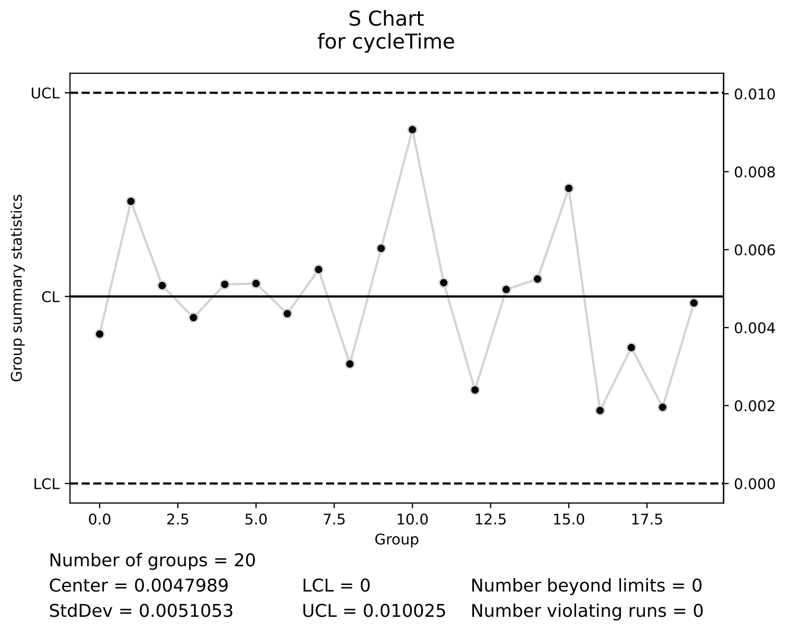

# Basic Concepts of Statistical Process Control

In general, a production process has many sources or causes of variation.
These can be further subdivided as
process inputs and process operational characteristics including
equipment, procedures and environmental conditions.
Environmental conditions consist of factors such as
temperature and humidity or work-tools. Visual guides for instance,
might not allow operators to precisely position parts on fixtures. The
complex interactions between material, tools, machine, work
methods, operators, and the environment combine to create
variability in the process. Factors that are permanent, as a
natural part of the process, are causing **chronic problems** and are
called **common
causes** of variation. The combined effect of common causes can be
described using probability distributions. It is important to
recognize that recurring
causes of variability affect every work process and that even under
a stable process there are differences in performance over time.
Failure to recognize variation leads to wasteful actions and detrimental
overcontrol.
The only way to reduce the negative
effects of chronic, common causes of variability is to modify the
process. This modification can occur at the level of the process inputs,
the process technology, the process controls or the process design.
Some of these changes are technical (e.g. different process
settings), some are strategic (e.g. different product
specifications) and some are related to human resources management
(e.g. training of operators). **Special causes**, 
**assignable causes**, or **sporadic spikes** arise from external temporary
sources that are not inherent to the process.  These
terms are used here interchangeably.
For example, an increase in temperature can potentially affect the
piston's performance. The impact can be both in terms of changes in
the average cycle times and/or the variability in cycle times.

In order to signal the occurrence of special causes we need a
control mechanism. Specifically in the case of the piston such a mechanism
can consist of taking
samples or subgroups of 5 consecutive piston cycle times. Within
each subgroup we compute the subgroup average and standard
deviation.

<table>
<tr><td>
<br>
__Fig. 2.5: $X$-bar Chart of Cycle Times under Stable Operating Conditions__
</td><td>
<br>
__Fig. 2.6: $S$ Chart of Cycle Times under Stable Operating Conditions__
</td></tr>
</table>

Figures 2.5 and 2.6 display charts of the average
and standard deviations of 20 samples of 5 time measurements.
To generate these charts with Python we use:

```
simulator = mistat.PistonSimulator(n_simulation=20, n_replicate=5, seed=1)
Ps = simulator.simulate()

Ps['seconds'].groupby(Ps['group']).apply(np.mean)
```
Output:
```
group
1 0.044902
2 0.042374
3 0.043812
4 0.048865
5 0.047265
6 0.043910
7 0.048345
8 0.041833
9 0.041135
10 0.045080
11 0.044307
12 0.047490
13 0.045008
14 0.045684
15 0.046281
16 0.044656
17 0.044445
18 0.044227
19 0.041077
20 0.044947
 Name: seconds, dtype: float64
```

The chart of averages is called an X-bar chart, the chart of
standard deviations is called an S chart. All 100 measurements were
taken under fixed operating conditions of the piston (all factors
set at the maximum levels). We note that the average of cycle
time averages is 0.045 seconds and that the average of the standard
deviations of the 20 subgroups is 0.0048 seconds.
All these
numbers were generated by the piston computer simulation model that allows
us to change the factors affecting the operating conditions of the
piston. Again we know that no changes were made to the control factors. The
observed variability is due to common causes only such as variability in
atmospheric pressure or filling gas temperature.