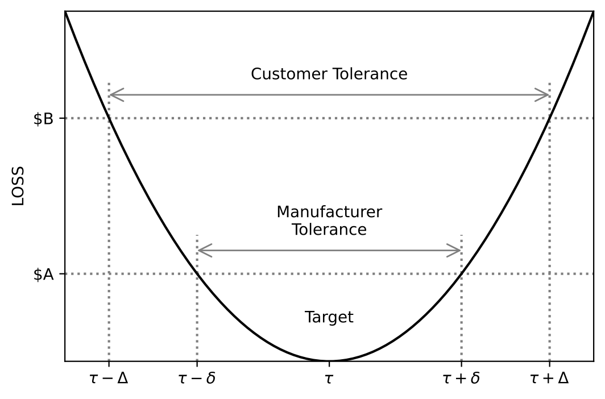

# Off-Line Quality Control, Parameter Design and The Taguchi Method

The performance of products or processes is typically quantified by
performance measures.  Examples include measures such as piston cycle time,
yield of a production process, output voltage of an electronic circuit, noise
level of a compressor or response times of a computer system.  These
performance measures might be affected by several factors that have to be set at
specific levels to get desired results.
For example the piston simulator introduced in previous chapters
has seven factors that can be used to control the piston cycle time.
The aim of off-line quality control is to determine the factor-level
combination that gives the least variability to the appropriate performance
measure, while keeping the mean value of the measure on target.  The goal is
to control **both** accuracy and variability.
In the next section we discuss an optimization
strategy that solves this problem by minimizing various loss functions.

## Product and Process Optimization using Loss Functions

Optimization problems of products or processes can take many forms that
depend on the objectives to be reached.  These objectives are typically
derived from customer requirements.  Performance parameters such as
dimensions, pressure or velocity usually have a target or nominal value.  The
objective is to reach the target within a range bounded by upper and lower
specification limits.  We call such cases **nominal is best**.  Noise
levels, shrinkage factors, amount of wear and deterioration are usually
required to be as low as possible.  We call such cases **the smaller the better**.  When we measure strength, efficiency, yields or time to failure
our goal is, in most cases, to reach the maximum possible levels.  Such cases
are called **the larger the better**.  These three types of cases
require different objective (target)
functions to optimize.  Taguchi introduced the concept of
**loss function** to help determine the appropriate optimization procedure.

When _nominal is best_ specification limits are typically two sided
with an upper specification limit (USL) and a lower specification limit
(LSL).  These limits are used to differentiate between conforming and
nonconforming products.  Nonconforming products are usually fixed, retested
and sometimes downgraded or simply scrapped.  In all cases defective products
carry a loss to the manufacturer.  Taguchi argues that only products on
target should carry no loss.  Any deviation carries a loss which is not
always immediately perceived by the customer or production personnel.
Taguchi proposes a quadratic function as a simple approximation to a graduated
loss function that measures loss on a continuous scale.  A quadratic loss
function has the form

$L(y,M) = K(y-M)^2,$

where $y$ is the value of the performance characteristic of a product, $M$ is
the target value of this characteristic and $K$ is a positive constant, which
yields monetary or other utility value to the loss.  For example, suppose
that $(M-\Delta,M+\Delta)$ is the **customer's tolerance interval** around
the target.  When $y$ falls out of this interval the product has to be
repaired or replaced at a cost of $ $A$.  Then, for this product,

$A = K\Delta^2$

or

$K = A/\Delta^2.$

The **manufacturer's tolerance interval** is generally tighter than that of
the customer, namely $(M-\delta,M+\delta)$, where $\delta < \Delta$.  One can
obtain the value of $\delta$ in the following manner.  Suppose the cost to
the manufacturer to repair a product that exceeds the customer's tolerance,
before shipping the product, is $ $B$, $B < A$.  Then

$B = \left(\frac{A}{\Delta^2}\right) (Y-M)^2,$

or

$Y = M \pm \Delta\left(\frac{B}{A}\right)^{1/2}.$

Thus,

$\delta = \Delta\left(\frac{B}{A}\right)^{1/2}.$

The manufacturer should reduce the variability in the product performance
characteristic so that process capability $C_{pk}$ for the tolerance interval
$(M-\delta,M+\delta)$ should be high.  See
Fig. 6.1 for a schematic
presentation of these relationships.

__Fig. 6.1 Quadratic Loss and Tolerance Intervals__

Notice that the expected loss is

$E\{L(Y,M)\} = K(\text{Bias}^2 + \text{Variance})$

where Bias $= \mu - M$, $\mu = E\{Y\}$ and Variance $= E\{(Y-\mu)^2\}$.
Thus, the objective is to have a manufacturing process with $\mu$ as close as
possible to the target $M$, and variance, $\sigma^2$, as small as possible
$(\sigma < \frac{\delta}{3}$ so that $C_{pk} > 1$).
Recall that Variance + Bias $^2$ is the Mean Squared Error, MSE.  Thus,
when _normal is best_ the objective should be to minimize the MSE.

Objective functions for cases of _the bigger the better_ or 
_the smaller the better_ depend on the case under consideration.  In cases
where the performance measure is the life length of a product, the
objective might be to design the product to maximize the expected life
length.  In the literature we may find the objective of minimizing
$\frac{1}{n} \sum \frac{1}{y^j}$, which is an estimator of
$E(\frac{1}{Y})$.  This parameter, however, may not always exist
(e.g. when $Y$ has an exponential distribution), and this objective
function might be senseless.