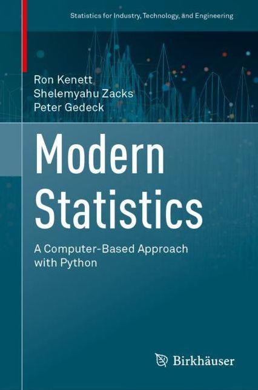

# Code repository
<table>
<tr>
<td></td>
<td>
Modern Statistics: A Computer Based Approach with Python

by Ron Kenett, Shelemyahu Zacks, Peter Gedeck

Publisher: Springer International Publishing; 1st edition (September 15, 2022)
ISBN-13: 978-3031075650
Buy on 
<a href="https://www.amazon.com/Modern-Statistics-Computer-Based-Technology-Engineering/dp/303107565X/">Amazon</a>, 
<a href="https://www.barnesandnoble.com/w/modern-statistics-ron-kenett/1141391736">Barnes & Noble</a>

<!-- Errata: http://oreilly.com/catalog/errata.csp?isbn=9781492072942 -->
</td>
</tr>
</table>

This part of the repository contains:

- `notebooks`: Python code of individual chapters combined in a Jupyter notebook - [download all as notebooks.zip](notebooks.zip)
- `code`: Python code for solutions as a plain Python filec - [download all as code.zip](solutions.zip)
- `solutions`: Python code for solutions combined in a Jupyter notebook - [download all as solutions.zip](solutions.zip)

