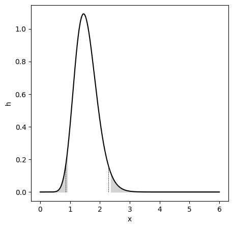

# Errata

The errata list is a list of errors and their corrections that were found after the product was released. Use the [Github issue tracker](https://github.com/gedeck/mistat-code-solutions/issues/new?assignees=&labels=&template=modern-statistics.md) to submit new errors.

## Chapter 3
- p. 186, Figure 3.15 - Incorrect distribution used to create the Figure. The updated code creates this Figure:
  
- p. 196 - Code sample, the print statement needs to contain f-strings. Replace
  ```
  print('Xbar {Xbar:.2f} / SX {SX:.3f}')
  print('Ybar {Xbar:.2f} / SY {SX:.3f}')
  ```
    with
  ```
  print(f'Xbar {Xbar:.2f} / SX {SX:.3f}')
  print(f'Ybar {Ybar:.2f} / SY {SY:.3f}')
  ```

## Chapter 8
- p. 404 - In equation 8.2, the matrix $V$ needs to be transposed:<br>
  $DTM \approx U * S * V'$
