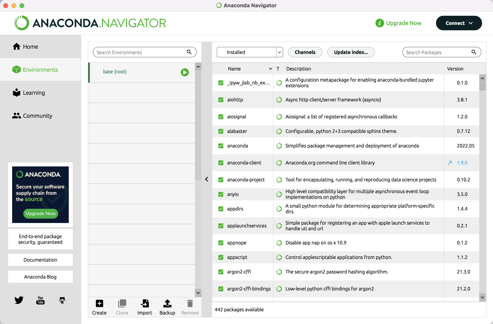
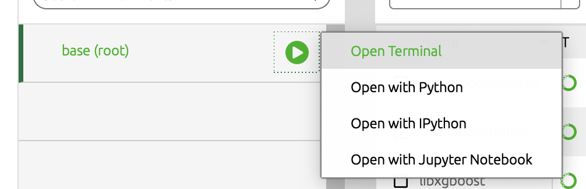
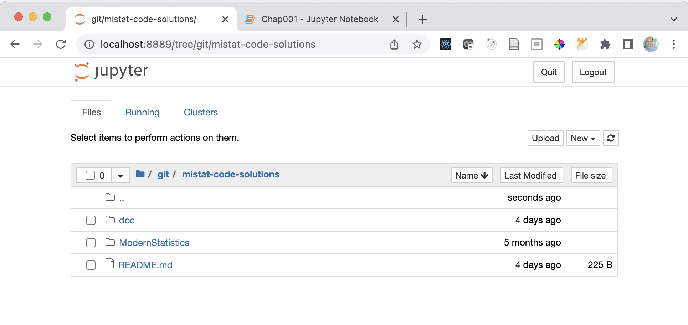
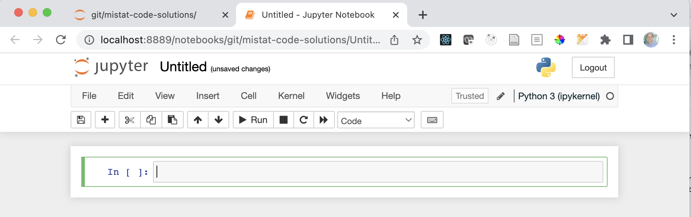
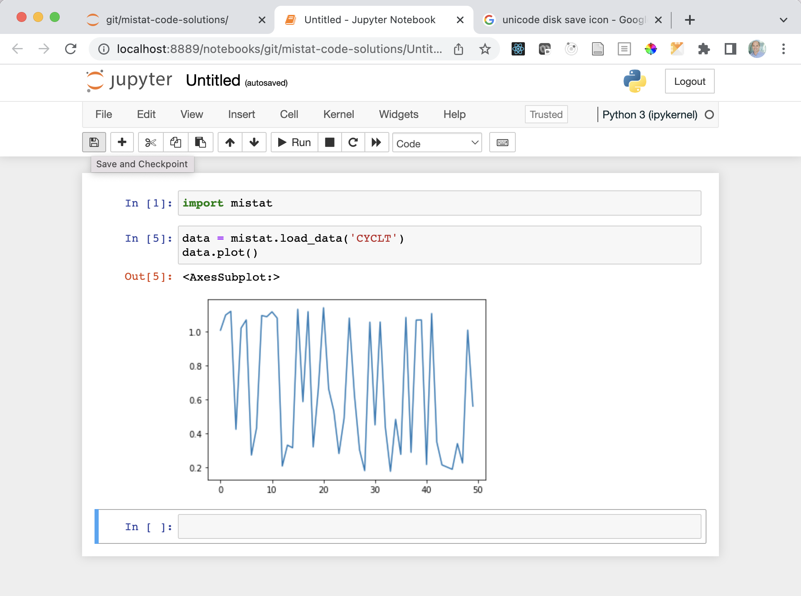

# Getting Started with Python
Python is a powerful, general purpose programming language that can be used for many applications ranging from short scripts to enterprise applications. There is a large and growing number of free, open-source libraries and tools for scientific computing. For more information about Python and its use visit [python.org.](https://www.python.org/).

## Install Python
There are many ways of using and developing with Python. However, a good start will be to use Jupyter notebooks, an interactive, browser-based Python interface available through the [Anaconda Distribution](https://www.anaconda.com/) which is particularly useful for scientific computing. We will be using Python 3.8 or newer. 

Here is what you need to do:

- Download the Anaconda installer for Python 3.8 or later from https://www.anaconda.com/download/ for your operating system (you will be asked for your email, however this step is optional and you can proceed without providing it)
- Execute the installer
  - macOS: double-click on the pkg file and follow the instructions using the default settings
  - Windows: run the exe file and follow the instructions using default settings
  - During installation of Anaconda, you are asked if you want to install DataSpell. This is optional, but can be a useful tool to get you started using Jupyter Notebooks.
  
Once the application is installed, you can execute Anaconda Navigator from the Start Menu (Windows) and the Application folder (macOS).

If you don’t want to use Anaconda, you will find installation instructions for Windows 10 at the end of this document.

## Anaconda Navigator – update and install packages 
You can use _Anaconda Navigator_ to manage your Python installation and run the Jupyter application. 

Use the _Environments_ tab to add packages to your Python installation. The package list looks like this:



**Advanced**: you can have custom environments for different projects. This is useful if you work on different projects. Click the <i>[+] Create</i> link to create a new environment.

Click the [Update index…] button to refresh the package list. From time to time, it may ask you to update the Anaconda Navigator application. It’s good practice to update regularly. 
If new versions become available, you will see that the version number changes. The version number of updatable packages are highlighted in blue and with an arrow next to the version number.
This means that you can update the specific package. Change the pull-down menu to [Updatable] and click the green tick mark to select [Mark for update]. Do that for all the packages you want to update, select [Apply] and confirm the update. 


Once you initiated the update, use the [Clear] button to remove the marking. Anaconda Navigator otherwise will indicate that it is busy when you want to close the application. 

Updates are done in the background and will take some time and may require confirmation.  There is no feedback that an update is finished. You will need to refresh the list using [Update index…] to see the progress.

## Anaconda Navigator – install packages

To install a package, change the pull down to [Not installed] and enter e.g. matplotlib in the [Search packages] field. Click on the rectangle to select the package for download and use the [Apply] button to start the installation. 
Once the library is installed, it will be listed under the installed packages.

- matplotlib: Python plotting package (https://matplotlib.org/)
- networkx: Python package for creating and manipulating graphs and networks (https://networkx.github.io/)
- numpy: NumPy is the fundamental package for array computing with Python (https://www.numpy.org/)
- pandas: Powerful data structures for data analysis, time series, and statistics (https://pandas.pydata.org/)
- scipy: SciPy: Scientific Library for Python
- scikit-learn (sklearn): A set of python modules for machine learning and data mining (http://scikit-learn.org/)
- seaborn: statistical data visualization (https://seaborn.pydata.org/)
- statsmodels: Statistical computations and models for Python (https://www.statsmodels.org/)
- xgboost: XGBoost is an optimized distributed gradient boosting library designed to be highly efficient, flexible and portable (https://xgboost.readthedocs.io/en/latest/)

**Advanced**: You can also install a library from the command line which may be faster, by using the command:
`conda install packagename` 

Not all packages are available in anaconda. They need to be installed using the Python package manager `pip` (see below).

- bootstrapped: Implementations of the percentile based bootstrap (https://github.com/facebookincubator/bootstrapped)
- dtreeviz: A Python 3 library for sci-kit learn, XGBoost, LightGBM, and Spark decision tree visualization (https://github.com/parrt/dtreeviz)
- KDEpy: Kernel Density Estimation in Python (https://github.com/tommyod/KDEpy)
- mistat: Modern Statistics / Industrial Statistics:
  A Computer Based Approach with Python (https://pypi.org/project/mistat/)
- pgmpy: A library for Probabilistic Graphical Models (https://github.com/pgmpy/pgmpy)
- pingouin: Pingouin: statistical package for Python (https://pingouin-stats.org/)
- scikit-fda (skfda): Functional Data Analysis Python package (https://fda.readthedocs.io/)


Some visualizations of networks require the graphviz software. It is best to install it using anaconda.

- graphviz: Application to visualize graphs (https://www.graphviz.org/) 
- python-graphviz: Python interface for graphviz (https://graphviz.readthedocs.io/en/stable/)
- pydotplus: Python interface to graphviz’s dot language. Required to visualize decision trees (http://pydotplus.readthedocs.io/) 


# Installing Python packages using `pip`
Not all Python packages are available through anaconda. They available through PyPI, the Python package index, and can be installed using the command 
```
pip install mistat 
```
on the command line. You can open a terminal window by clicking on the green arrow icon and selecting [Open Terminal].



In the terminal, enter the command followed by the _return_ key. The command demonstrates how to install the `mistat` package. Replace it with a different packagename to install other packages.

You can also install packages from a Jupyter notebook using the following commands. You will only need to do this once.

```
# Install a pip package in the current Jupyter kernel
import sys
!{sys.executable} -m pip install mistat
```


# Anaconda Navigator – Launch Python in a Jupyter Notebook
We recommend that you use the Jupyter notebooks in this repository to study the code and work on the the exercises. The Jupyter notebook is a web-based computing environment that runs on your computer and embeds Python code and output together with comments and graphics in one readable document. In the last years, this has become a popular way for interactive data analysis in the data science community.

To start Jupyter notebook, click on the green arrow button and select [Open with Jupyter Notebook]. This wil start the Jupyter server and launches the notebook inside your usual web browser.



The supported browsers are Chrome, Safari, or Firefox. An up-to-date version of Edge may also work; if not, use one of the supported browsers.

The Jupyter notebook application opens a file manager page which allows you to browse to your working directory. You can also create new folders [New/Folder] and text files [New/Text File] here.

To rename a file or folder select it and use [Rename] to change the name.
 
Create a folder to keep your work for the course and navigate into the folder. Next use [New/Python 3] to create a new notebook which opens in a separate tab or window.

# Jupyter notebook

This is what an empty notebook looks like.



Click on Untitled and replace it with as more meaningful title.

You can enter Python code in the code boxes and execute it using the [Run] button. 




The output and result of the last statement in each code box is printed underneath each block. 

Jupyter notebooks regularly saves your work automatically. If you want to trigger the save manually, click the [Save] icon, use the [File|Save and Checkpoint] menu or press [Ctrl/Cmd-S] key.

If you find an error in your code, you can modify it and rerun the code. From time to time, you may want to rerun the whole code in your notebook; use the menu [Kernel/Restart & Run All] for this.

